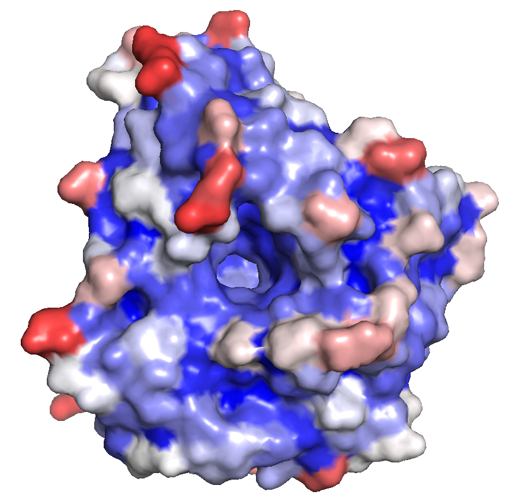

# Solvent accessibility

To run before mutagenisis analysis (like MutateX), because ...

### Running

from the solvent_accessilibility folder, run something like this for the 6EKZ structure

```bash
python normalization.py --column Empirical --stride 6EKZ_out.txt --out 6EKZ_out2
```

#### Options:

--column: str - with name of the column that you want to use for normalization.
--stride: str - with the name of the file containing the STRIDE output that needs to be normalized.
--out: str - name of the outfile

### Normalize

Using table 1 in this paper (one of the rows) - will use empirical for now.
https://pmc.ncbi.nlm.nih.gov/articles/PMC3836772/

Residue Theoretical Empirical Miller et al. (1987) Rose et al. (1985)
Alanine 129.0 121.0 113.0 118.1
Arginine 274.0 265.0 241.0 256.0
Asparagine 195.0 187.0 158.0 165.5
Aspartate 193.0 187.0 151.0 158.7
Cysteine 167.0 148.0 140.0 146.1
Glutamate 223.0 214.0 183.0 186.2
Glutamine 225.0 214.0 189.0 193.2
Glycine 104.0 97.0 85.0 88.1
Histidine 224.0 216.0 194.0 202.5
Isoleucine 197.0 195.0 182.0 181.0
Leucine 201.0 191.0 180.0 193.1
Lysine 236.0 230.0 211.0 225.8
Methionine 224.0 203.0 204.0 203.4
Phenylalanine 240.0 228.0 218.0 222.8
Proline 159.0 154.0 143.0 146.8
Serine 155.0 143.0 122.0 129.8
Threonine 172.0 163.0 146.0 152.5
Tryptophan 285.0 264.0 259.0 266.3
Tyrosine 263.0 255.0 229.0 236.8
Valine 174.0 165.0 160.0 164.5

# normalization.py

Normalizes solvent accessibility (ASA) values from STRIDE output using reference values from published normalization tables. Optionally generates a PyMOL coloring script to visualize accessibility directly on the protein structure.

---

## Requirements

- Python 3.9+
- pandas
- numpy

Install dependencies:

```bash
pip install pandas numpy
```

STRIDE must be run separately before using this script. See below.

## Running Stride

See [STRIDE documentation](https://github.com/heiniglab/stride.git) for how to generate the input file.

**Publication**
Frishman D, Argos P. Knowledge-Based Protein Secondary Structure Assignment Proteins: Structure, Function, and Genetics 23:566-579 (1995)

To compile the code i just cloned the stride git repository and compiled using:

```bash
make stride
```

from within the "stride" folder.

---

## Usage

```bash
python normalization.py --stride <stride_output.txt> [options]
```

### Arguments

| Argument   | Required | Default              | Description                                                       |
| ---------- | -------- | -------------------- | ----------------------------------------------------------------- |
| `--stride` | Yes      | —                    | Path to STRIDE output file                                        |
| `--column` | No       | `Empirical`          | Normalization reference values to use                             |
| `--out`    | No       | `normalized_ASA.txt` | Output file name (`.csv` is appended automatically)               |
| `--pdb`    | No       | —                    | Path to PDB file — if provided, generates a PyMOL coloring script |

### `--column` choices

| Option         | Reference                      |
| -------------- | ------------------------------ |
| `Theoretical`  | Theoretical maximum ASA values |
| `Empirical`    | Empirical values (default)     |
| `Miller et al` | Miller et al. (1987)           |
| `Rose et al`   | Rose et al. (1985)             |

---

## Examples

Basic run with default settings (Empirical normalization):

```bash
python normalization.py --stride 6EKZ_out.txt
```

Specify normalization column and output file:

```bash
python normalization.py --stride 6EKZ_out.txt --column Theoretical --out 6EKZ_normalized
```

Also generate a PyMOL coloring script:

```bash
python normalization.py --stride 6EKZ_out.txt --pdb 6EKZ_clean.pdb --out 6EKZ_normalized
```

With spaces in the column name, use quotes:

```bash
python normalization.py --stride 6EKZ_out.txt --column "Miller et al"
```

---

## Output

### Normalized ASA table (`<out>.csv`)

Tab-separated file with one row per residue:

| Column           | Description                                      |
| ---------------- | ------------------------------------------------ |
| `ResNum`         | Residue number                                   |
| `Residue`        | Amino acid full name (e.g. Glycine)              |
| `Chain`          | Chain ID                                         |
| `Area`           | Raw solvent accessible area from STRIDE (Ų)     |
| `<norm_col>`     | Reference normalization value used               |
| `Normalized_ASA` | Normalized value (0 = buried, 1 = fully exposed) |

### PyMOL script (`<out>.pml`) — optional

Generated when `--pdb` is provided. Opens the structure in PyMOL and colors each residue by normalized ASA:

- Blue → buried (0)
- White → partially exposed (~0.5)
- Red → fully exposed (1.0+)

Run with:

```bash
pymol <out>.pml
# or on Mac if pymol is not in PATH:
/Applications/PyMOL.app/Contents/MacOS/PyMOL <out>.pml
```

---

## Input file requirements

### STRIDE output (`--stride`)

Standard STRIDE output file. The script reads lines starting with `ASG` and extracts residue name, chain, residue number, and accessible surface area.

### Normalization table

The script expects a file called `normalization.txt` in the same directory, tab-separated, with a `Residue` column containing full amino acid names (e.g. `Glycine`, `Alanine`) and columns matching the reference names above.

---

## Notes

- Normalized ASA values slightly above 1.0 are normal — reference values are averages, so individual residues can exceed them
- Residues not found in the normalization table will have `NaN` in the normalized column
- The script uses the 3-letter to full-name mapping internally; your normalization table should use full names


