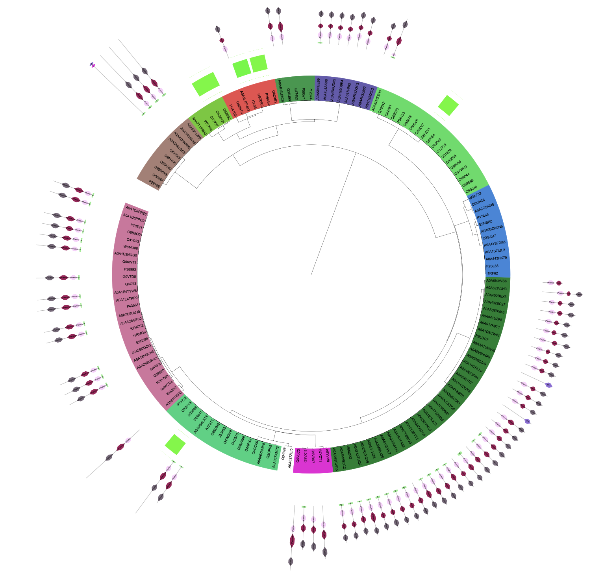

# Industrial Enzyme Discovery
This is a short folder on some of the methods that Kristian showed us in his new **Industrial Enzyme Discovery** course. 

## Background
The course is designed to find suitable enzyme candidates for an industrial application. For example, one of the groups has the task to find a bacterial alternative to bovine trypsine, which is a widely used industrial enzyme. 
In our case, of course, the goal is to find potential candidates that could degrade BADGE/Amine curing agents. 

The general idea/workflow for finding a **curated sequence space** is:
 Find a seed -> Expand the seed -> Homology reduce the selection -> Perform clustering using CUPP3 -> Make a tree on iTOL -> Determine which part of the tree is relevant

## The seed
Any sequence based search needs a starting point (the seed). We chose to go with the ItL-03 enzyme (see the Laccase folder/rahnella-sasipa) from [Sasipa's paper](https://www.google.com/url?sa=t&source=web&rct=j&opi=89978449&url=https://ediss.sub.uni-hamburg.de/bitstream/ediss/12070/1/Dissertation_Wongwattanarat_2025.pdf&ved=2ahUKEwiflLaE3qSTAxVkFhAIHXfsLcQQFnoECBgQAQ&usg=AOvVaw0SuIwQJiliTKCi3YQHx0FH). As the sequence is not available on UniProt, we decided to paste the sequence into [InterPro](https://www.ebi.ac.uk/interpro/) to see which superfamilier/PFAMs/domains it had. The results can be found under this [search ID](https://www.ebi.ac.uk/interpro/result/InterProScan/iprscan5-R20260314-134933-0509-65071606-p1m/). 
Some (maybe) interesting data:
- *Superfamily*: Multicopper oxidases (MCO)
- *PFAMs*: PF07732 & PF07731. PFAM is a comprehensive, widely used database of **protein families and domains**. It's not based on BLAST for homology search, but on HMMs. [Wikipedia](https://en.wikipedia.org/wiki/Pfam#:~:text=The%20general%20purpose%20of%20the,then%20each%20frame%20is%20searched.)
- It has *3 domains/active sites*, as confirmed by Sasipa's paper


## Expansion of the seed
We chose to search for other proteins of the same superfamily. We searched for IPR045087 and got 90.000 results on UniProt. Since this is a too large amount for the clustering program, we chose to only use the enzymes with an annotation score of 3 or higher (2 or higher could also work and might be interesting, but we'd have to use the HPC for that). **Important note**: The ItL03 sequence isn't inside these 90K/50K/15K sequences, so we added it manually in fasta format.


Before using Kristians CUPP3 programme, it's important to homology reduce the sequences using mmseqs2. This is basically to avoid redundancy, i.e. 2 or more sequences which are more than 90% similar. You can do this either [online](https://toolkit.tuebingen.mpg.de/tools/mmseqs2) by pasting the fasta file into the tool, or locally on your computer. 

I'd recommend using a local conda environment for the mmseqs clustering if run locally, and especially for Kristian's CUPP3 program. Here's how I did it:
```
%% Set up the virtual environment & packages

conda create -n cupp_env python=3.10 -y
conda activate cupp_env
pip install -r requirements.txt

%% Install mmseqs

conda install -c conda-forge -c bioconda mmseqs2

%% Check

mmseqs --version

%% run mmseqs, 90% seq ID

mmseqs easy-cluster input.faa OUT_FOLDER tmp --min-seq-id 0.9
```

Either way, you get the clustered output file `your_sequences_cluster_rep_seq.fasta` and `your_sequences_cluster_all_seq.fasta`. The first one is the reduced one, with only the representative sequences of each cluster left, and the second one still has all the sequences ordered by groups. 

For example, if the sequences of >CueO, >Itl03, and >HHM1 have more than 90% similarity, the mmseqs algorithm will group them into one cluster. The `your_sequences_cluster_all_seq.fasta` will display them like this: 
```
>CueO3
>CueO3
Sequence of CueO3
>ItL03
Sequence of ItL03
>HHM1
Sequence of HHM1
```
while the `your_sequences_cluster_rep_seq.fasta` will only show the sequence of CueO3.

## CUPP3 Clustering
Conserved Unique Peptide Patterns (CUPP) is a approach for sequence analysis employing conserved peptide patterns for determination of similarities between proteins. CUPP performs unsupervised clustering of proteins for formation of protein groups and can be used for fast annotation of enzyme protein family, subfamily and EC function of carbohydrate-active enzymes.

CUPP3 is an algorithm developed by Kristian to (relatively) quickly make a phylogenetic tree. It also fetches metadata (domains, taxonomic info, EC number, etc..) for all the sequences which can then be used for annotating the tree in [iTOL](https://itol.embl.de). 

### How to run CUPP3?

1. Download the CUPP3 folder inside this repo
2. Put your homology reduced sequence inside that folder (`your_sequences_cluster_rep_seq.fasta`)
3. Delete the `OWN1.faa` file and rename the homology reduced sequence `OWN1.faa`
4. Ensure your virtual environment (cupp_env, see above) is active
5. run `python run.py`

The output files are inside the ./CUPP/itol folder, and are:

- OWN1_fa8x2_90.tree, the file you will have to give to itol
- The OWN1 folder, which contains all the clade names, etc, and an additional files folder with all the metadata (EC number, taxonomic info, etc)

## iTOL (interactive tree of life)

To see which part of the huge tree was actually/potentially relevant to us, we looked at the superfamily on UniProt again; but this time, we only took the reviewed sequences where EC numbers were available (also annotation score 5 only). EC is a classification system of enzymes by their function. 

We then chose 4 enzymes where the function was definitely wrong/not interesting to us, and 5-6 enzymes which could be relevant (CueO from *E.coli*, laccase-degrading enzymes, etc..)

**Relevant sequences**
- P06811, fungal, Lignin degradation and detoxification of lignin-derived products.  [UniProt](https://www.uniprot.org/uniprotkb/P06811/entry)
- Q53692, Streptomyces, Aromatic ring coupling enzyme  [UniProt](https://www.uniprot.org/uniprotkb/Q53692/entry)
- S8FGV1, Laccase, Lignin degrading [UniProt](https://www.uniprot.org/uniprotkb/S8FGV1/entry)
- D4GPK6, Lignin-degrading archeal enzyme [UniProt](https://www.uniprot.org/uniprotkb/D4GPK6/entry)
- P07788, B. subtilis, Multicopper oxidase that catalyzes the oxidation of a variety of substrates, including phenolic and non-phenolic compounds. [UniProt](https://www.uniprot.org/uniprotkb/P07788/entry)

**Irrelevant sequences**
- Q9BQS7, Human, Hephaestin, Involved in Ferric oxidoreduction/transmembrane transport [UniProt](https://www.uniprot.org/uniprotkb/Q9BQS7/entry)
- M4DUF2, L-ascorbate oxidase, high salinity stress response, Brassica sp. [UniProt](https://www.uniprot.org/uniprotkb/M4DUF2/entry)
- P00450, Human, Fe transport  [UniProt](https://www.uniprot.org/uniprotkb/P00450/entry)

We marked these enzymes on the tree, and saw that the relevant enzymes (green bars) clustered in a very specific region of the tree, which we defined as our curated sequence space. The purple lines are all the enzymes belonging to a certain plant species (*Vitis vinifera*). If these are "far away" from each other on the tree, it likely means that they have a different function (don't worry too much about this, the explanation during the course was very confusing lol).


This is the curated sequence space, which has around 150 sequences (curated.faa in the Fasta files folder). It also shows the protein domains for some of the enzymes.

 A strategy could be to choose one candidate from each clade (colored bar) and test it in our pipeline


