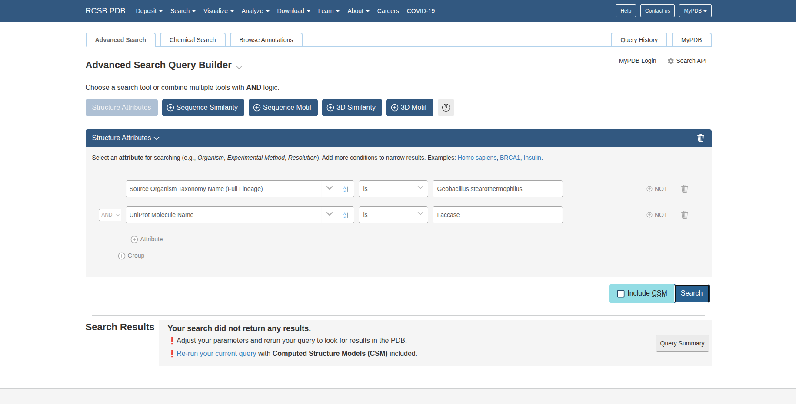

# Investigating Laccases from Geobacillus as potential enzymes for breakdown of BADGE

From this paper: https://doi.org/10.1007/s11356-024-34095-y (available in Google Drive under Research Articles) we know that laccases from Geobacillus thermoparafinivorans and Geobacillus stearothermoparafinivorns can degrade BADGE (Bisphenol A glycidyl ether). See Table 1 in the paper or figure below (last 2 entries). However Geobacillus stearothermoparafinivorns is mentioned in the title of the paper as Geobacillus stearothermophilus. Next step is to search for these enzymes in public databases. Authors mention that they used NCBI to retrieve the sequence

## Protein Data Bank Search (V1)

1. Head to: https://www.rcsb.org/

2. Click on Advanced Search under the search bar

3. By filling information as shown below, we get no results:

This means either there is no structure or it is not annotated propely in Protein Data Bank. Thus, we will try UniProt and NCBI as alternatives.

## UniProt Search

1. Head to: https://www.uniprot.org/

2. Change from UniProt to UniPark

3. By filling these fields in the "Advanced" Search Bar we see that information is only available for Geobacillus Stearothermophilus:

Alternatively we could type this in the search bar:
- (protein_name:Laccase) AND (taxonomy_name:"Geobacillus stearothermophilus")

4. After hitting search we should see something like this:

5. By clicking on the Download button and choosing 'FASTA' as the format we retrieve the sequences in a FASTA file. The file can be found under *data/* named *uniparc_protein_name_Laccase_AND_taxo_2026_02_16.fasta*.

6. Then we can proceed to visualization with Phylogenetic tree or Logo plots.

## NCBI Search

1. Head to: https://www.ncbi.nlm.nih.gov/

2. Click on Proteins to the left panel

3. Change from All Databases to Protein and hit Search

4. Click on Advanced, fill in information, as shown in the figure below and hit Search:

Alternatively we could type this in the search bar:
- (Laccase[Protein Name]) AND Geobacillus Stearothermophilus[Organism]

5. You should see the following results:

6. Scroll down and Click *Send to* --> *File* --> *FASTA*. Corresponding FASTA file is located under *data/* named *ncbi_protein_protein_name_Laccase_AND_taxo_2026_02_16.fasta*.

7. As with UniProt we can proceed to visualization with Phylogenetic tree or Logo plots.

## Protein Data Bank Search (V2)

1. After retrieving the FASTA files we observe the sequence is highly conserved. Thus we provide one of the sequences from the files as input to the Protein Data Bank's Search Bar. The query sequence used is:

*MPDIFQQEAQGWLRCGAPPFAGAVAGLTTKQGGESEGPFASLNMGLHVGDDRMHVVNNRRRLAEWLSVPLDHWVCCEQVHGAVIRKVTKGDRGSGAHDFAAAVRGADGLYTDEAGVLLALCFADCVPVYFIAPSAGLVGLAHAGWRGTAGGIVQNMVRLWQEREHIAPSDIYAAVGPAIGPCCYTVDDRVIDGLRPTLPAGGPLPWRETSQGQYALDLKEANRLQLAAAGIPDCHIYVSERCTSCEKALFFSHRRDRGTTGRMLAFIGRREETA*

2. With this approach (compared to V1) we get a list of structures as results:

3. The first 3 hits have 86% sequence identity with the query sequence (as of 17/02/2026) and state Geobacillus Stearothermophilus as an organism. The 1st hit is an uncharacterised structure and the 3rd hit is in complex with inosine, so we are gonna focus on the 2nd hit, which is *6T0Y*.

4. This structure (*6T0Y*) is the crystal structure of YlmD from Geobacillus stearothermophilus. In the corresponding publication available under the *Literature* section, it is mentioned that: "In this method, YlmD, YfiH, and FAMIN254I, in contrast to a conventional laccase, elicited only minuscule signals", which validates that *6T0Y* is a laccase enzyme.

5. Additionally in the article is mentioned that: "YlmD (Uniprot P84138, PDB 1T8H; from Geobacillus stearothermophilus, phylum Firmicutes)". So we now know the original PDB id (*1T8H*) and the UniProt code (*P84138*) of this enzyme.

## Molecular Docking

1. Head to: https://pubchem.ncbi.nlm.nih.gov/compound/Bisphenol-A-diglycidyl-ether and search for "Bisphenol A diglycidyl ether"

2. Click on the 1st hit and search for the SMILES format: "CC(C)(C1=CC=C(C=C1)OCC2CO2)C3=CC=C(C=C3)OCC4CO4"

3. Head to: https://www.swissdock.ch/

4. Click on Docking with AutoDock Vina

5. Now fill in the information on the server ...